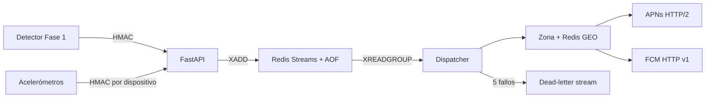

# Decisiones arquitectónicas iniciales

## Límites de módulos

| Módulo | Responsabilidad | No debe hacer |
|---|---|---|
| `config.py` | Cargar y validar configuración | Abrir conexiones |
| `seedlink.py` | Orquestar workers por proveedor, recibir y reconectar | Hacer HTTP síncrono |
| `processor.py` | Búfer, filtro, STA/LTA por estación | Confirmar un sismo global |
| `coincidence.py` | Asociar disparos únicos en tiempo | Procesar ondas |
| `alerts.py` | Serializar, imprimir y POST webhook | Bloquear la ingesta |
| `official.py` | Consultar, normalizar y asociar reportes oficiales | Retrasar el candidato inicial |
| `api/webhooks.py` | Autenticar y persistir eventos en Streams | Enviar push |
| `api/devices_store.py` | Tokens e índices zona/GEO | Conservar secretos APNs/FCM |
| `dispatcher/consumer.py` | Entrega, recovery, cooldown y DLQ | Procesar ondas |
| `dispatcher/push.py` | Construir y enviar payloads APNs/FCM | Decidir si hubo sismo |
| `crowdsourcing/` | Firmar, agrupar PGA y emitir candidatos | Mezclar pings con STA/LTA antes de persistir |

## Estado y concurrencia

- Cada proveedor habilitado tiene conexión, hilo y backoff independientes.
- ObsPy entrega trazas mediante el loop SeedLink de ese proveedor.
- Cada procesador protege su estado con un lock y mantiene datos crudos acotados.
- El detector de coincidencia tiene su propio lock; esto permite evolucionar a
  procesamiento paralelo sin corromper la ventana de eventos.
- Un router crea detectores separados por zona geográfica. Países vecinos sí
  pueden contribuir a la misma zona; estaciones lejanas nunca se mezclan.
- El I/O HTTP se mueve a una cola y un worker. En producción esa cola en memoria
  debe sustituirse por transporte durable.
- El polling oficial usa un pool acotado independiente y `Event.wait`, de modo
  que el apagado no tenga que esperar todos los intervalos de reintento.

## Flujo durable y push

La semántica es *at least once*. Idempotencia de ingesta evita reinsertar el
mismo `event_id`; cooldown e idempotencia de update reducen push repetido. No
existe una transacción distribuida entre Redis y APNs/FCM, por lo que permanece
una pequeña ventana de duplicado si el worker cae después del envío y antes de
persistir su resultado. La aplicación móvil también debe deduplicar por ID.

## Enriquecimiento oficial posterior

La ruta crítica termina al publicar `earthquake_candidate`. En paralelo,
`OfficialReportService` selecciona conectores por `country_codes`, añade USGS
como fallback global y consulta con reintentos acotados. FDSN/GeoJSON, JSON,
JMAXML y ArcGIS se normalizan a `OfficialReport`; el matcher exige proximidad
temporal y, cuando hay coordenadas de estaciones, proximidad al centroide
aproximado. El resultado se publica como `official_report_update` usando el
mismo dispatcher/webhook.

Esta separación impide que una API lenta o caída aumente la latencia de alerta.
En producción ambos mensajes deben ir a un bus durable y la capa móvil debe
reconciliarlos mediante `candidate_event_id`. El centroide de estaciones no se
presenta como epicentro y el match conserva sus deltas para auditoría.

## Contrato de integración de Fase 2

`EarthquakeCandidate.to_dict()` es el contrato inicial. El consumidor debe usar
`event_id` como clave idempotente y rechazar timestamps demasiado antiguos. La
API no debe transformar automáticamente todo candidato en push crítico: debe
aplicar versión de esquema, autenticidad, zona objetivo, confianza, TTL,
cancelaciones y reglas operativas.

## Escalamiento sugerido

Particionar por clúster geográfico, no aleatoriamente por estación. Cada clúster
necesita suficientes estaciones para decidir localmente. Publicar disparos y
candidatos en un log durable permite ejecutar en paralelo asociación,
localización, magnitud e intensidad sin alargar el camino crítico de detección.

## Incorporación de un proveedor o país

1. Confirmar en documentación oficial que existe un SeedLink público; un visor
   web o archivo descargable no es equivalente.
2. Obtener NSLC, coordenadas, respuesta instrumental y latencia actual.
3. Añadir el proveedor al generador o una estación a `seedlink.providers`, con
   `country_code`, `zone_id`, coordenadas y selector NSLC.
4. Configurar al menos `minimum_stations` estaciones físicas distintas.
5. Probar aceptación de suscripciones, llegada de trazas y replay etiquetado.

Si dos proveedores redistribuyen la misma estación, `network.station` sigue
siendo la identidad física usada por coincidencia y solo cuenta una vez.

## Escala mundial

`config.global.json` es un catálogo generado, no una lista mantenida a mano. Las
zonas se asignan completas a shards mediante SHA-256 estable. Cinco shards
respetan el máximo documentado de cinco conexiones concurrentes de EarthScope;
cada shard mantiene como máximo una conexión por proveedor. Los candidatos de
todos los shards deben confluir en una cola durable e idempotente.

El catálogo global solo demuestra disponibilidad de metadatos FDSN en la fecha
de generación. Un monitor de producción debe deshabilitar streams con latencia,
huecos o rechazo SeedLink y regenerar el catálogo periódicamente.
